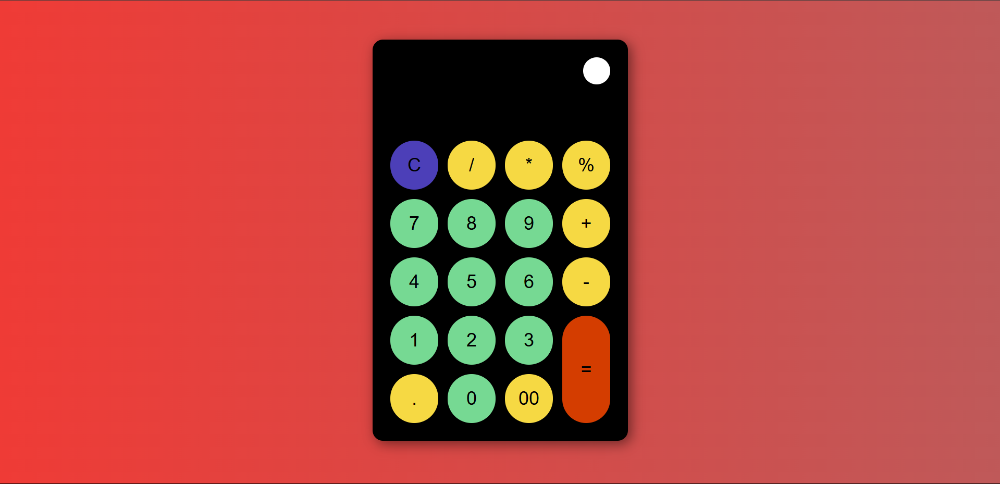
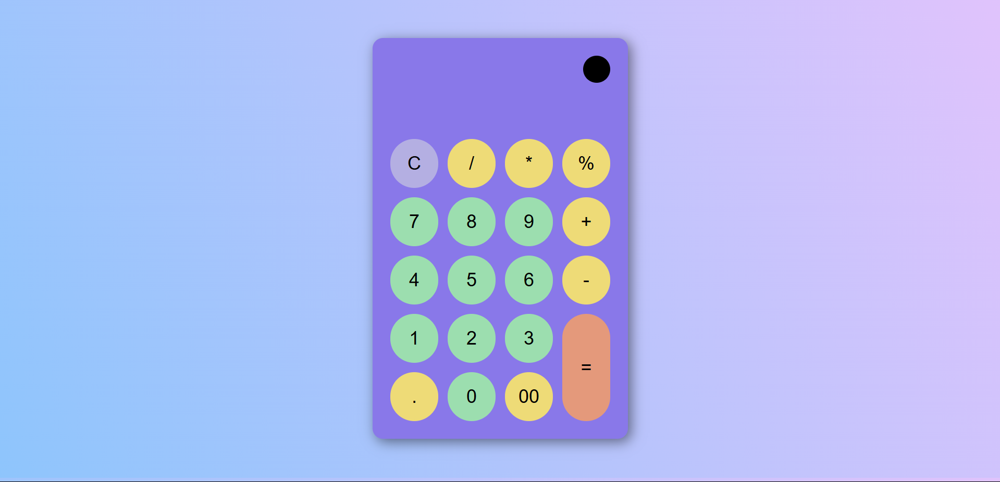

# Calculadora Web
Este es un proyecto a modo de practica de una calculadora simple desarrollada con HTML, CSS y JavaScript. Permite realizar operaciones matemáticas básicas como suma, resta, multiplicación y división.

## Tecnologías utilizadas
- HTML5
- CSS3
- JavaScript (Vanilla JS)

## Características
- Interfaz intuitiva y fácil de usar.
- Operaciones matemáticas básicas: suma, resta, multiplicación y división.
- Diseño responsivo para diferentes dispositivos.
- Funcionalidad de limpiar la pantalla.
- Botón para cambiar el modo (modo claro/oscuro).
- Guardar la preferencia del modo en localStorage

## Capturas de pantalla

